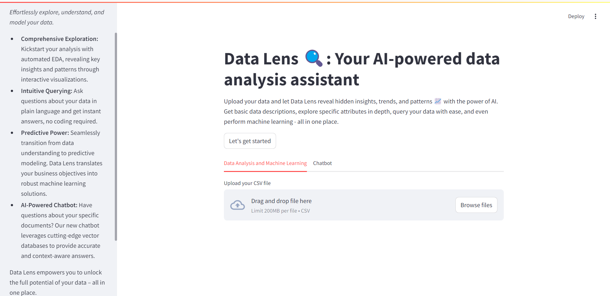

# Data Lens 🔍  - Your AI-Powered Data Analysis Assistant

Data Lens is an all-in-one web application that empowers you to explore, understand, and model your data with ease. 

##  ✨ The Interface 



## ✨ Features

* **Automated Exploratory Data Analysis (EDA):** 
    - Generate insightful summaries and visualizations of your data automatically. 
    - Uncover hidden patterns, trends, and relationships with ease.

* **Intuitive Data Querying:**
    - Ask questions about your data in natural language – no coding required! 
    - Data Lens translates your queries into powerful data analysis operations. 

* **AI-Driven Predictive Modeling:**
    - Effortlessly transition from data exploration to building predictive models. 
    - Data Lens guides you through the process of selecting and training models tailored to your business needs.

* **Context-Aware Chatbot:**
    - Get instant answers to your questions based on your specific documents.
    - Our chatbot leverages advanced vector databases to provide accurate and contextually relevant information.

## 🚀 Getting Started

### Installation

1. **Clone the Repository:**
   ```bash
   git clone https://github.com/VijayV28/data-lens.git
   ```

2. **Create a Conda Environment:**
   ```bash
   conda env create -f environment.yml
   ```

3. **Activate the Environment:**
   ```bash
   conda activate data-lens
   ```

### Configuration

1. **Create a `.env` File:** 
   Create a file named `.env` in the root directory of the project and add your API keys in the following format:
   ```
   OPENAI_API_KEY=your_openai_api_key
   PINECONE_API_KEY=your_pinecone_api_key 
   ```

2. **Run the App:**
   ```bash
   cd app
   streamlit run app.py 
   ```

## 📝 License

This project is licensed under the MIT License - see the [LICENSE](LICENSE) file for details. 
